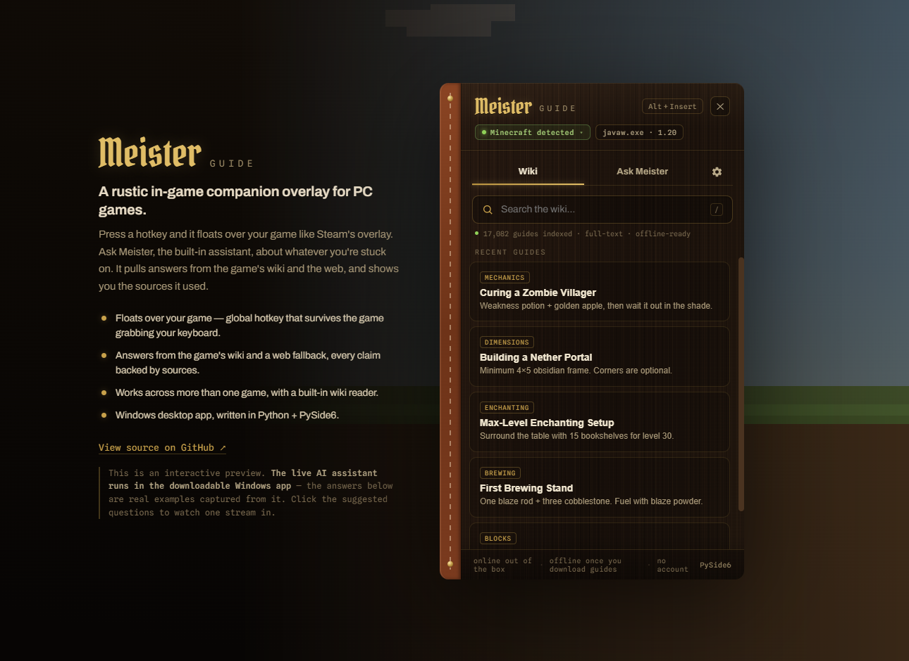

# Meister Guide

Meister Guide is an AI powered Windows app written in Python that helps with any
questions you have while playing. It finds the answers on the respective game's
wiki and compiles the information to give tips, tricks and guides to improve your
gaming experience, displaying them in an overlay triggered by a programmable hotkey
(Alt + Insert). Out of the box it's online (wiki + DuckDuckGo) and works offline
once you've downloaded guides.

## Try it

**Demo in your browser (no install):** <https://hpeen.github.io/MeisterGuide/>

**Download for Windows:** <https://github.com/Hpeen/MeisterGuide/releases>

The browser demo is a self-contained preview. The live AI and wiki fetching run in
the downloadable Windows app.

## Features

- Floats over your game with a global hotkey (Alt + Insert), even when the game has
  grabbed your keyboard.
- Answers come from the game's wiki with a web fallback, and every claim links back
  to the page it came from.
- Three places to look, in order: your offline guides, the live wiki, then a web
  search as a last resort.
- Online out of the box (wiki + DuckDuckGo, no account or key for web search), and
  works offline once you've downloaded guides.
- Handles more than one game, with a built-in wiki reader for browsing guides on
  their own.
- Pick your backend: Claude (online) or Ollama (local and free).

## Usage Guide

### Setting it up

1. Run `MeisterGuide.exe`. It will appear in the system tray.
2. Set up a backend in the ⚙ Settings tab:
   - Claude: paste an API key from console.anthropic.com.
   - Ollama: install it, run `ollama pull llama3`, leave backend on Auto.
3. Press Alt + Insert to show or hide the overlay. NOTE: The overlay can only be on
   top in windowed or borderless windowed mode, not exclusive fullscreen.

### Asking a question

Open the Ask Meister tab and ask it questions like "How do I get a Mace?". It will
give an answer and list the pages it used. Click a source to read it in the Wiki
tab. New chat clears it, while the history dropdown reopens an old one.

### Adding another game

⚙ Settings → Add a game: enter a name, its wiki URL (ex: `https://subnautica.fandom.com`),
and the process name (ex: `Subnautica.exe`).

## How it works

When you ask something, Meister checks three sources in order: the guides you've
downloaded offline, the game's wiki fetched live for your question, and a plain web
search as a last resort. The first two cover most questions; the web search is the
safety net so you rarely get nothing back.

Fetching wiki text turned out to be the tricky part. minecraft.wiki exposes a clean
plain-text API, but most Fandom wikis don't have that extension installed, so the
same request comes back empty. Meister checks each wiki once for that capability and
caches the answer. If the plain-text API is missing, it asks for the rendered HTML
instead and runs it through trafilatura to pull out the article body. Same pipeline
either way, so adding a Fandom game just works.

## Build it yourself / run from source

Python 3.11 or newer, and a backend to answer questions: either a Claude API key
(entered in the app, stored on your machine) or a running Ollama install. See
[BUILD.md](BUILD.md) to run from source or build the `.exe`.

## Credits

Built with [PySide6](https://doc.qt.io/qtforpython/) (Qt for Python) for the
overlay, [trafilatura](https://trafilatura.readthedocs.io/) for extracting article
text from wiki pages, [Ollama](https://ollama.com) for local models, and
[Claude](https://www.anthropic.com) for the online backend. Web search uses
DuckDuckGo, and guide content comes from the community wikis on minecraft.wiki and
Fandom.
